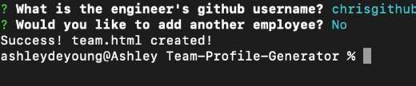

# Team Profile Generator

  ## Description
  
  This project is an team generator command line application that creates an HTML page based on user information about their team.

  ## User Story

 ```
    As a manager

    I want to generate a webpage that displays my team's basic info

    so that I have quick access to emails and GitHub profiles
 ```

  ## Table Of Contents
  
  * [Installation](#installation)

  * [Tests](#tests)
  
  * [Usage](#usage)
  
  * [Demo of Application](#demo-of-application)
  
  * [Questions](#questions)
  
  ## Installation
  
  To install necessary dependencies, run the following command:
  
  ```
  npm i
  ```
  Once dependencies are installed, the application is ready to run. 

  ## Test

  To test application, run the following command:

   ```
  npm run test
  ```

  ## Usage

  To run the application from the command line please run the following command:

  ```
  node app.js
  ``` 
  
  Following the command, the user will be instructed to answer questions regarding their team.

  

  
  Once the user has submitted information on all employees, the data input is written in the generate HTML file and the user is notifed.

  
  

  The user can now view the generated HTML in the output directory:

  ```
  $ cd output/
  $ code .
  ``` 


  ## Demo of Application
  

  *demo of command to run application and generated questions*

  
  
  *demo of generated HTML from command line*


  ## Questions
  
  If you have any questions about this project, please contact ashleydeyoung at ashley.d.deyoung@gmail.com.